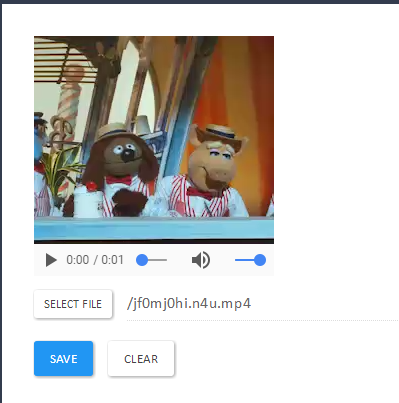

# Images

Put an image on anything. Supports drag'n'drop. Try it with **people** or **products**.

 **Note:** the application has been migrated to Polymer 1.x.
- Latest Polymer 0.5 commit: https://github.com/Polyjuice/Images/commit/324dee2e78bb5aaef8863270d597332215078be3
- Latest Polymer 0.5 release: https://github.com/Polyjuice/Images/releases/tag/2.0.4

## Partials

### GET /images/partials/content/`{Content ObjectID}`

Shows a simple page for `Content` preview, image or video. In case of unexisting content, shows empty file preview image.

Screenshot:


### GET /images/partials/content-edit/`{Content ObjectID}`

Shows a simple page for `Content` preview and allows to update it with new file. 

Screenshot:



In case of unexisting content, creates new content and shows drag'n'drop upload area for new image.

Screenshot:


### GET /images/partials/illustrations/`{Something ObjectID}`

Shows a carousel for images that become `Illustration` of `Something` in read only mode. 

Screenshot:


In case of unexisting something, shows empty carousel with single empty file preview image.

Screenshot:


### GET /images/partials/illustrations-edit/`{Something ObjectID}`

Shows a carousel for images that become `Illustration` of `Something` with drag'n'drop upload area and button to add new illustrations. 

Screenshot:


In case of unexisting something, shows empty carousel with empty drag'n'drop upload area.

Screenshot:


Sample mapping:

```cs
StarcounterEnvironment.RunWithinApplication("Images", () => {
    Handle.GET("/images/partials/concept-YOURCLASS/{?}", (string objectId) => {
        return Self.GET("/images/partials/illustrations-edit/" + objectId);
    });

    UriMapping.OntologyMap<YOURAPP.YOURCLASS>("/images/partials/concept-YOURCLASS/{?}");
});
```

## License

MIT
