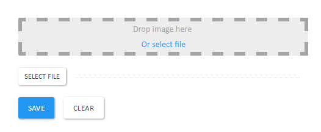
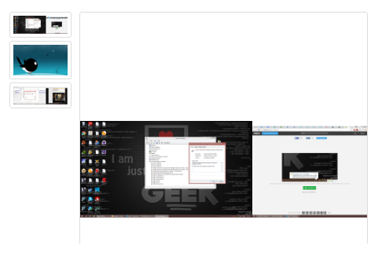
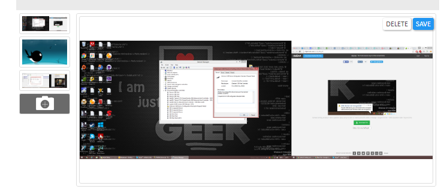
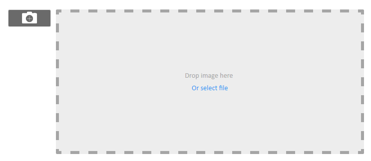

# Images

Put an image on anything. Supports drag'n'drop. Try it with **people** or **products**.

 **Note:** the application has been migrated to Polymer 1.x.
- Latest Polymer 0.5 commit: https://github.com/Polyjuice/Images/commit/324dee2e78bb5aaef8863270d597332215078be3
- Latest Polymer 0.5 release: https://github.com/Polyjuice/Images/releases/tag/2.0.4

## Installation instructions

This app requires [SignIn](https://github.com/starcounterapps/signin) 4.0.0 or newer.

The following resources are available only for a signed in user:
* `/images`
* `/images/partials/images`

The following resources doesn't require additional permissions:
* `/images/image`
* `/images/partials/image/`
* `/images/image/{?}`
* `/Images/partials/image/{?}`
* `/images/contents/{?}`
* `/images/partials/contents/{?}`
* `/images/contents-edit/{?}`
* `/images/partials/contents-edit/{?}`
* `/images/somethings/{?}`
* `/images/partials/somethings/{?}`
* `/images/somethings-edit/{?}`
* `/images/partials/somethings-edit/{?}`
* `/images/partials/illustrations/{?}`
* `/images/partials/concept-somebody/{?}`
* `/images/partials/concept-vendible/{?}`
* `/images/partials/concept-chatmessage/{?}`
* `/images/partials/concept-chatattachment/{?}`

See the [instructions for the SignIn app](https://github.com/StarcounterApps/People#creating-the-first-user) to create a first user.

### Creating the first user

This app will set up priviledges for a default admin user group, but does not create that that group.

The correct way to install this app is:

1. Install and start SignIn app
2. Run [`http://localhost:8080/signin/generateadminuser`](http://localhost:8080/signin/generateadminuser). Handler of this URL creates the `Admin (System Users)` group and the `admin` user in that group.

## Partials

### GET /images/partials/contents/`{Content ObjectID}`

Shows a simple page for `Content` preview, image or video. In case of unexisting content, shows empty file preview image.

Screenshot:


### GET /images/partials/contents-edit/`{Content ObjectID}`

Shows a simple page for `Content` preview and allows to update it with new file.

Screenshot:


In case of unexisting content, creates new content and shows drag'n'drop upload area for new image.

Screenshot:



### GET /images/partials/illustrations/`{Illustration ObjectID}`

Shows the content of an illustration relation object. Uses `/images/partials/contents/` internally, so looks like that partial.

Screenshot:


In case the illustration does not have a content, shows an error message.

Screenshot:


### GET /images/partials/illustrations-edit/`{Illustration ObjectID}`

Shows the content of an illustration relation object and allows to update it with new file. Uses `/images/partials/contents-edit/` internally, so looks like that partial.

Screenshot:


### GET /images/partials/somethings/`{Something ObjectID}`

Shows a carousel for images that become `Illustration` of `Something` in read only mode.

Screenshot:



In case of unexisting something, shows empty carousel with single empty file preview image.

Screenshot:


### GET /images/partials/somethings-single/`{Something ObjectID}`

Shows the first found `Illustration` of `Something` in read only mode.

Screenshot:


In case of something does not have an illustration, shows an empty page.

### GET /images/partials/somethings-single-static/`{Something ObjectID}`

Shows a static representation of the first found `Illustration` of `Something` in read only mode.

Screenshot:


In case of something does not have an illustration, shows an empty page.

### GET /images/partials/somethings-edit/`{Something ObjectID}`

Shows a carousel for images that become `Illustration` of `Something` with drag'n'drop upload area and button to add new illustrations.

Screenshot:



In case of unexisting something, shows empty carousel with empty drag'n'drop upload area.

Screenshot:



Sample mapping:

```cs
StarcounterEnvironment.RunWithinApplication("Images", () => {
    Handle.GET("/images/partials/concept-YOURCLASS/{?}", (string objectId) => {
        return Self.GET("/images/partials/somethings-edit/" + objectId);
    });

    UriMapping.OntologyMap<YOURAPP.YOURCLASS>("/images/partials/concept-YOURCLASS/{?}");
});
```

## License

MIT
